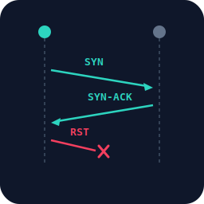

<p align="center">
  
</p>

# syn-probe

A half-open TCP SYN port prober. Pure Go, statically compiled, zero dependencies, ~2 MB binary.

Detects whether a TCP port is open without completing the three-way handshake. Built for environments where `connect()`-based tools report a port as open before the service behind it is actually ready.

## The problem with `connect()`

Every common TCP readiness tool - `nc -z`, `bash /dev/tcp`, Python `socket.connect()`, Ansible `wait_for`, Go `net.Dial()`, `curl`, `telnet` - uses the `connect()` system call. This completes the full TCP three-way handshake:

```
    client                        server
      │                             │
      │──── SYN ───────────────────►│
      │◄─── SYN-ACK ────────────────│
      │──── ACK ───────────────────►│  ← connection is now ESTABLISHED
      │                             │
```

Once the handshake completes, the connection is placed into the kernel's **TCP accept queue** - a backlog of established connections waiting for the application to call `accept()`. The `connect()` call returns success at this point, regardless of whether the application is actually ready to handle the connection.

For services that are already running and actively calling `accept()`, this is fine - connections are picked up immediately. But there are common scenarios - VMs booting, containers starting, services initialising after a deploy - where a port enters the LISTEN state before the application behind it is ready.

### False positives during startup

There are many situations where a port is in the LISTEN state but the application behind it isn't ready to handle connections:

- **Socket activation** (systemd, inetd, launchd) - the init system owns the listening socket and spawns the service on demand. The kernel accepts the TCP connection immediately, but the service process hasn't started yet.
- **Slow application startup** - the application has called `listen()` but is still initialising (loading config, connecting to databases, warming caches) and hasn't reached its `accept()` loop yet.
- **Container/VM boot** - the kernel's TCP stack is up and responding to SYN before userspace services are ready.

In all of these cases, `connect()` succeeds and reports the port as "open". But the connection sits in the accept queue with nobody calling `accept()`. The client hangs - an SSH session stalls at banner exchange, an HTTP request gets no response, a database connection times out.

### Accept queue pollution

When the port is listening but nobody is calling `accept()`, each `connect()` from a polling loop creates a real established connection that gets queued. By the time the service starts and begins calling `accept()`, the queue contains connections from earlier polling attempts where the client has already timed out or moved on.

The service processes these stale connections in FIFO order - reading, waiting for data that never comes, hitting its idle timeout, closing the socket - before it reaches any genuine client. The more aggressively you polled, the more stale connections the service has to drain first.

This only applies during the startup window where the port is listening but nobody is accepting. Once the service is up and actively calling `accept()`, `connect()`-based polling works fine and connections are handled immediately.

```
  During startup (port listening, service not yet accepting):

  poll 1  → connect() → queued ──────────────────────┐
  poll 2  → connect() → queued ───────────────────┐  │
  poll N  → connect() → queued ────────────────┐  │  │
                                               │  │  │
  Service starts, drains queue in FIFO order:  ▼  ▼  ▼
  accept() → stale → timeout → close → accept() → stale → ...
                                                        ↑
                                            real client waits here
```

## What syn-probe does instead

syn-probe performs a **half-open SYN scan**. It sends a raw TCP SYN and listens for the SYN-ACK, but never sends the final ACK. Instead, it immediately sends a RST to tear down the connection:

```
    syn-probe                     server
      │                             │
      │──── SYN ───────────────────►│
      │◄─── SYN-ACK ────────────────│
      │──── RST ───────────────────►│  ← connection torn down
      │                             │
```

The connection is never established. It never enters the accept queue. The server's TCP stack discards the half-open state when it receives the RST.

This means:

- **No false positives**: syn-probe only reports "open" when the kernel TCP stack replies with SYN-ACK, confirming the port is listening.
- **No accept queue pollution**: because the handshake is never completed, no connection is queued. Polling in a loop doesn't create stale connections that the service must drain.
- **No impact on the target**: each probe is a single SYN packet followed by a RST. The target's TCP stack handles this entirely in the kernel with no overhead on the application.

## Why not use...

| Tool | Issue |
|---|---|
| `nc -z` / `connect()` | Completes the handshake. Can give false positives and pollute the accept queue when the port is listening but the service isn't accepting yet. |
| `bash /dev/tcp` | Uses `connect()`. Same issues. |
| `wait_for` (Ansible) | Uses `connect()`. Same issues. |
| `net.Dial()` (Go) | Uses `connect()`. Same issues. |
| `nmap -sS` | Correct approach (SYN scan), but 100+ MB with pcap/Lua/NSE dependencies. No built-in poll mode. Not embeddable. |
| `hping3` | SYN-capable but unmaintained, not widely packaged, no poll mode, output designed for humans. |
| `scapy` | Correct approach and the reference implementation syn-probe replicates. But requires Python + pip + scapy. Not a standalone binary. |

## Usage

```
syn-probe syn  <host> <port>                                  # one-shot check
syn-probe wait <host> <port> [--timeout S] [--interval S]     # poll until open
```

**`syn`** - Single probe. Prints `open` (exit 0) or `closed` (exit 1). Use for conditional checks in scripts.

**`wait`** - Repeated polling. Prints `open after N attempts` (exit 0) or `timeout after N attempts` (exit 1). Use as a readiness gate.

```bash
# Check if a port is open right now
syn-probe syn 172.20.0.2 22 && echo "ready" || echo "not yet"

# Block until port 22 opens (30s timeout, probe every 200ms)
syn-probe wait 172.20.0.2 22 --timeout 30 --interval 0.2

# Works inside network namespaces
ip netns exec fc-netns syn-probe wait 172.20.0.2 22
```

| Flag | Default | Description |
|---|---|---|
| `--timeout` | `30` | Maximum wait time in seconds (`wait` mode only) |
| `--interval` | `0.3` | Seconds between probes (`wait` mode only) |

| Exit code | Meaning |
|---|---|
| 0 | Port is open |
| 1 | Port is closed or timeout reached |
| 2 | Usage error or fatal startup error |

### Requirements

- Linux (uses `AF_PACKET`, a Linux-specific socket type)
- Root or `CAP_NET_RAW` capability
- IPv4 only

## How it works

syn-probe operates at Layer 2 using `AF_PACKET / SOCK_RAW / ETH_P_ALL` - the same raw Ethernet socket type that scapy uses internally (`L3PacketSocket`). It constructs Ethernet frames, IP headers, and TCP segments by hand and sends/receives them as raw bytes on the wire.

This Layer 2 approach is necessary for operating on bridge networks (e.g. probing targets connected via TAP or veth interfaces on a Linux bridge). Operating at Layer 2 gives full control over Ethernet framing, ARP resolution, and packet filtering - all of which are needed for reliable operation in this environment.

### ARP resolution with broadcast fallback

Before sending a SYN, syn-probe needs the destination MAC address. It performs its own ARP resolution by sending a raw ARP request and listening for the reply - it never reads `/proc/net/arp` or the kernel ARP cache.

This matters in environments where IP addresses are reassigned - containers, VMs, DHCP leases. After a target is destroyed and a new one is created on the same IP, the kernel ARP cache contains the old target's MAC. Using the stale MAC means packets go nowhere.

During early startup, the target's network stack may not be up yet and won't respond to ARP. When this happens, syn-probe falls back to the broadcast MAC (`ff:ff:ff:ff:ff:ff`). On a bridge network the bridge delivers broadcast frames to all ports, including the correct interface - so the SYN reaches the target even without a resolved MAC. This broadcast fallback matches scapy's behaviour and was the critical fix for reliable detection during startup.

Once the target's network stack is up, ARP succeeds and syn-probe caches the resolved unicast MAC for subsequent probes (re-attempting ARP every 5 probes until it succeeds).

### BPF kernel filtering

Each probe phase attaches a BPF (Berkeley Packet Filter) program to the socket:

- **ARP phase**: kernel only delivers ARP replies from the target IP
- **SYN phase**: kernel only delivers TCP/IP packets from the target IP

Without BPF, the userspace receive loop processes every packet transiting the bridge - ARP broadcasts, DHCP, other targets' traffic, multicast. During startup when there's a burst of network activity, the receive loop can exhaust its timeout processing irrelevant packets and miss the SYN-ACK entirely. BPF eliminates this by filtering in the kernel before packets reach userspace.

### Other details

- **PACKET_OUTGOING filter**: `AF_PACKET / ETH_P_ALL` delivers both incoming and outgoing frames. syn-probe skips outgoing packets (`sll_pkttype == PACKET_OUTGOING`) to avoid processing its own transmitted frames.
- **Socket buffer flush**: the receive buffer is drained before each ARP request and each SYN send, ensuring only fresh responses are processed.
- **Stale ARP cache flush**: on startup, runs `ip neigh flush to <dst>` to clear any stale kernel ARP entry for the target IP.
- **Promiscuous mode**: enabled via `PACKET_MR_PROMISC`, matching scapy's socket setup.

## Building

```bash
make          # builds syn-probe-linux-amd64 and syn-probe-linux-arm64
make clean
```

Produces statically linked binaries (`CGO_ENABLED=0`, stripped):

```
syn-probe-linux-amd64   ~2.0 MB
syn-probe-linux-arm64   ~2.1 MB
```
